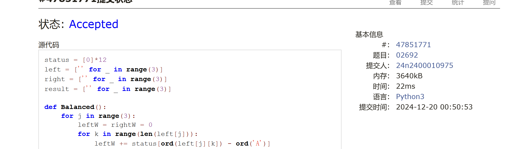
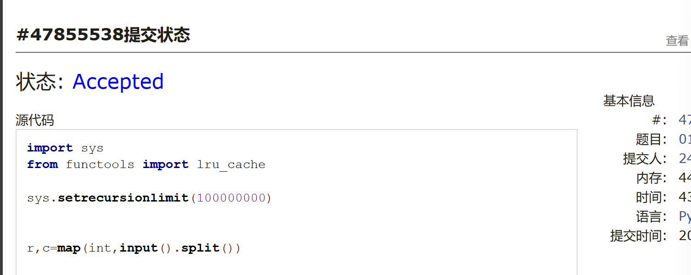
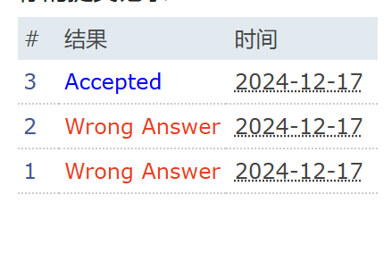
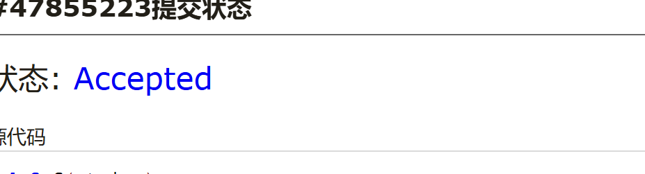
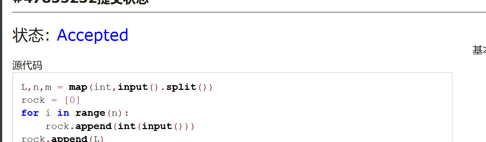

# Assignment #D: 十全十美 

Updated 1254 GMT+8 Dec 17, 2024

2024 fall, Complied by <mark>同学的姓名、院系</mark>


**说明：**

1）请把每个题目解题思路（可选），源码Python, 或者C++（已经在Codeforces/Openjudge上AC），截图（包含Accepted），填写到下面作业模版中（推荐使用 typora https://typoraio.cn ，或者用word）。AC 或者没有AC，都请标上每个题目大致花费时间。

2）提交时候先提交pdf文件，再把md或者doc文件上传到右侧“作业评论”。Canvas需要有同学清晰头像、提交文件有pdf、"作业评论"区有上传的md或者doc附件。

3）如果不能在截止前提交作业，请写明原因。


## 1. 题目

### 02692: 假币问题

brute force, http://cs101.openjudge.cn/practice/02692

思路：见证了《正难则反》的真正用法


代码：
#暴力遍历
status = [0]*12
left = ['' for _ in range(3)]
right = ['' for _ in range(3)]
result = ['' for _ in range(3)]

def Balanced():
    for j in range(3):
        leftW = rightW = 0
        for k in range(len(left[j])):
            leftW += status[ord(left[j][k]) - ord('A')]
            rightW += status[ord(right[j][k]) - ord('A')]
    
        if leftW>rightW and result[j][0]!='u':
            return False
        if leftW == rightW and result[j][0]!='e':
            return False
        if leftW<rightW and result[j][0]!='d':
            return False
    
    return True

for _ in range(int(input())):
    for i in range(3):
        left[i], right[i], result[i] = input().split()
    
    for i in range(12):
        status[i] = 0
    
    i = 0
    for i in range(12):
        status[i] = 1
        if Balanced():
            break
        
        status[i] = -1
        if Balanced():
            break
        
        status[i] = 0
    
    print('{} is the counterfeit coin and it is {}.'.format( chr(i+ord('A')), \
                    "heavy" if status[i]>0 else "light"))

```python

```


代码运行截图 <mark>（至少包含有"Accepted"）</mark>



### 01088: 滑雪

dp, dfs similar, http://cs101.openjudge.cn/practice/01088

思路：dp，递推公式是dp[x][y]==max(四个方向的dp)+1
具体的话，要注意一下，dp表的初始不可以是真的（不可以是1
要自己改，初始为0或者-1都可以


代码：

```python

```
import sys
from functools import lru_cache

sys.setrecursionlimit(100000000)


r,c=map(int,input().split())

ditu=[list(map(int,input().split())) for _ in range(0,r)]

dp=[[0]*c for i in range(0,r)]

fangxiang={(0,1),(0,-1),(1,0),(-1,0)}

def dfs(x,y):
    if dp[x][y]>0:
        return
    for dx,dy in fangxiang:
        nx=x+dx
        ny=dy+y
        if 0<=nx<r and 0<=ny<c and ditu[nx][ny]<ditu[x][y]:
            dfs(nx,ny)
            dp[x][y]=max(dp[x][y],dp[nx][ny]+1)
    if dp[x][y]==0:
        dp[x][y]+=1


for i in range(0,r):
    for j in range(0,c):
        dfs(i,j)
out=0
for i in dp:
    out=max(out,max(i))

print(out)


代码运行截图 ==（至少包含有"Accepted"）==




### 25572: 螃蟹采蘑菇

bfs, dfs, http://cs101.openjudge.cn/practice/25572/

思路：我的做法是两种情况，螃蟹横着，螃蟹竖着，然后分别做一个函数，这个题解比我想的好多了！！！


代码：
from collections import deque

n = int(input())
mat = []
for i in range(n):
    mat.append(list(map(int, input().split())))
a = []
for i in range(n):
    for j in range(n):
        if mat[i][j] == 5:
            a.append([i, j])
lx = a[1][0] - a[0][0]
ly = a[1][1] - a[0][1]
dire = [[-1, 0], [0, 1], [1, 0], [0, -1]]
v = [[0] * n for i in range(n)]


def bfs(x, y):
    v[x][y] = 1
    quene = deque([(x, y)])
    while quene:
        x, y = quene.popleft()
        if (mat[x][y] == 9 and mat[x + lx][y + ly] != 1) or \
                (mat[x][y] != 1 and mat[x + lx][y + ly] == 9):
            return 'yes'
        for i in range(4):
            dx = x + dire[i][0]
            dy = y + dire[i][1]
            if 0 <= dx < n and 0 <= dy < n and 0 <= dx + lx < n \
                    and 0 <= dy + ly < n and v[dx][dy] == 0 \
                    and mat[dx][dy] != 1 and mat[dx + lx][dy + ly] != 1:
                quene.append([dx, dy])
                v[dx][dy] = 1
    return 'no'


print(bfs(a[0][0], a[0][1]))
```python

```


代码运行截图 <mark>（至少包含有"Accepted"）</mark>




### 27373: 最大整数

dp, http://cs101.openjudge.cn/practice/27373/

思路：
已放弃


代码：
def f(string):
    if string=='':
        return 0
    else:
        return int(string)
m=int(input())#最大位数
n=int(input())#正整数数量
l=input().split()
#冒泡排序
for i in range(n):
    for j in range(n-1-i):
        if l[j] + l[j+1] > l[j+1] + l[j]:
            l[j],l[j+1] = l[j+1],l[j]
weight=[]#每个元素的位数
for num in l:
    weight.append(len(num))
#dp[i][j]在前i数中选择，不超过j位，最大可能数值
dp=[['']*(m+1) for _ in range(n+1)]
for k in range(m+1):
    dp[0][k]=''#无法组成整数
for q in range(n+1):
    dp[q][0]=''#无法组成整数
for i in range(1,n+1):
    for j in range(1,m+1):
        if weight[i-1]>j:#不能选第i个，因为会超位数
            dp[i][j]=dp[i-1][j]
        else:#可以选第i个也可以不选
                dp[i][j]=str(max(f(dp[i-1][j]),int(l[i-1]+dp[i-1][j-weight[i-1]])))
print(dp[n][m])
```python

```


代码运行截图 <mark>（至少包含有"Accepted"）</mark>



### 02811: 熄灯问题

brute force, http://cs101.openjudge.cn/practice/02811

思路：
和上面的那个假币问题差不多
关键是生成64个01010101数组，感觉考场上可以直接自己打出来？反正只有64个


代码：
X = [[0,0,0,0,0,0,0,0]]
Y = [[0,0,0,0,0,0,0,0]]
for _ in range(5):
    X.append([0] + [int(x) for x in input().split()] + [0])
    Y.append([0 for x in range(8)])    
X.append([0,0,0,0,0,0,0,0])
Y.append([0,0,0,0,0,0,0,0])

import copy
for a in range(2):
    Y[1][1] = a
    for b in range(2):
        Y[1][2] = b
        for c in range(2):
            Y[1][3] = c
            for d in range(2):
                Y[1][4] = d
                for e in range(2):
                    Y[1][5] = e
                    for f in range(2):
                        Y[1][6] = f
                        
                        A = copy.deepcopy(X)
                        B = copy.deepcopy(Y)
                        for i in range(1, 7):
                            if B[1][i] == 1:
                                A[1][i] = abs(A[1][i] - 1)
                                A[1][i-1] = abs(A[1][i-1] - 1)
                                A[1][i+1] = abs(A[1][i+1] - 1)
                                A[2][i] = abs(A[2][i] - 1)
                        for i in range(2, 6):
                            for j in range(1, 7):
                                if A[i-1][j] == 1:
                                    B[i][j] = 1
                                    A[i][j] = abs(A[i][j] - 1)
                                    A[i-1][j] = abs(A[i-1][j] - 1)
                                    A[i+1][j] = abs(A[i+1][j] - 1)
                                    A[i][j-1] = abs(A[i][j-1] - 1)
                                    A[i][j+1] = abs(A[i][j+1] - 1)
                        if A[5][1]==0 and A[5][2]==0 and A[5][3]==0 and A[5][4]==0 and A[5][5]==0 and A[5][6]==0:
                            for i in range(1, 6):
                                print(" ".join(repr(y) for y in [B[i][1],B[i][2],B[i][3],B[i][4],B[i][5],B[i][6] ]))
```python

```


代码运行截图 <mark>（至少包含有"Accepted"）</mark>


### 08210: 河中跳房子

binary search, greedy, http://cs101.openjudge.cn/practice/08210/

思路：已放弃


代码：
L,n,m = map(int,input().split())
rock = [0]
for i in range(n):
    rock.append(int(input()))
rock.append(L)

def check(x):
    num = 0
    now = 0
    for i in range(1, n+2):
        if rock[i] - now < x:
            num += 1
        else:
            now = rock[i]
            
    if num > m:
        return True
    else:
        return False
lo, hi = 0, L+1
ans = -1
while lo < hi:
    mid = (lo + hi) // 2
    
    if check(mid):
        hi = mid
    else:               # 返回False，有可能是num==m
        ans = mid       # 如果num==m, mid可能是答案
        lo = mid + 1
        
#print(lo-1)
print(ans)
```python

```


代码运行截图 <mark>（至少包含有"Accepted"）</mark>



## 2. 学习总结和收获

<mark>如果作业题目简单，有否额外练习题目，比如：OJ“计概2024fall每日选做”、CF、LeetCode、洛谷等网站题目。</mark>
太难了。这几天做了很多M的题目，T的题目就直接跳过了，速刷题解，不再一个一个debug了
leecode上的题目也做了一些，把之前每日选做又梳理了一下，整理了一下笔记。
然后自己重新复习语法基础，我感觉回去打基础是未来几天的重要任务。
除了上机课，周三我还有一门考试，复习不完了哇，只能有取有舍了  < ：（ >


